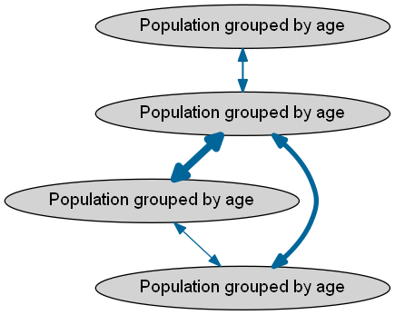
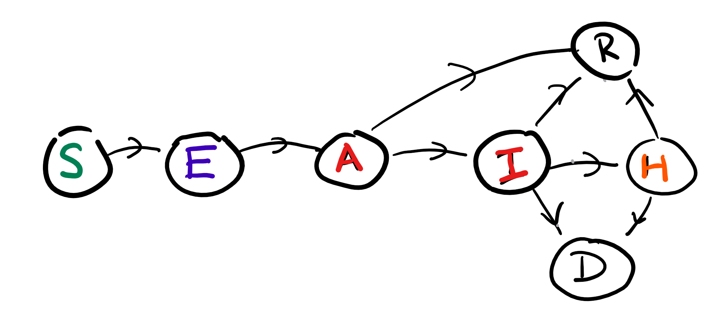

# simple_network_sim

> :warning: **The code and data in this repository are currently for testing and development purposes only.**

[](https://travis-ci.org/ScottishCovidResponse/simple_network_sim)
[](https://codecov.io/gh/ScottishCovidResponse/simple_network_sim)
[](https://simple-network-sim.readthedocs.io/en/latest/?badge=latest)

## Summary

Adaptation of a simple network simulation model to COVID-19 (forked from https://github.com/magicicada/simple_network_sim to be brought into the SCRC consortium GitHub organisation - this, the SCRC owned repository is the main repository for development). Similar models have previously been used to model other disease outbreaks with different characteristics to COVID-19.

## Features

simple_network_sim represents a geographical area (e.g. Scotland) as a series of connected nodes in a network. These could be counties, health board areas, hospitals or even, in a special case, individuals. Each node is of the same type in a given network (e.g. all counties). Some nodes have more movement between them than others.



**Network representing a geographical area, thicker lines indicate more movement**

Within each node is a population, stratified by age group into **y**oung, **m**ature and **o**ld. 

The progress of the epidemic is modelled within nodes using compartments describing the number of people in various disease states within the node. There is one of these sets of compartments per node.



**Disease state compartments within each network node**

As simulated time incrementally moves forward, the model predicts the number of people in each disease state in each node taking into account:

- Movement of people between nodes
- Progression through disease state compartments within each node (affected by mixing between age stratified sub-populations)

A more detailed model overview [here](model_overview_simple_network_sim.md).

## Contributing

Please read our [contributing information](contributing.md).

## Installation

Install [miniconda](https://docs.conda.io/en/latest/miniconda.html) (it also works with [anaconda](https://docs.anaconda.com/anaconda/install/), but we do not need the extra packages). With conda installed, run the following commands to create the virtual environment and activate it:

```
conda env create -f environment.yml
conda activate simple_network_sim
```

## Reproducible builds

In order to ensure reproducibility, we export a [spec-file.txt](https://docs.conda.io/projects/conda/en/latest/user-guide/tasks/manage-environments.html#building-identical-conda-environments) whenever we change dependencies for this project. The file pins the version for every dependency and subdependencies of the project.  Since the CI use that file to set up the environment, it is linux specific. A conda environment can be created with it by running:

```
conda create --name simple_network_sim --file spec-file.txt
conda activate simple_network_sim
```

The file can be created with the following command:

```
conda list --explicit > spec-file.txt
```

## Tests

Simple network sim has regression tests and unit tests. Regression tests ensure that changes to the code do not alter overall functionality in a simulated use case, compared with previous versions of the software. Unit tests ensure that individual components of the software (e.g. functions) work as intended. The current test regime does not check if model outputs are "correct" or "valid", merely that the software is working as expected.

### Test data

Test data is stored in `tests/test_data` and mirrors the structure of `sample_input_files/` - these files are not used in automated tests but provided to allow users to run simple network sim from the command line (`sample_output_files/` are also not part of automated testing). [Baseline test data](###Approach-to-regression-testing) is stored in `tests/regression/data`.

### Running the tests

After activating your conda environment, execute the following command:

```{shell}
pytest --cov=simple_network_sim tests
```

### Approach to regression testing

Our approach updating regression test data is based on matplotlib's `matplotlib.testing.decorators.image_comparison`.
The functions `tests.utils.compare_mpl_plots` and `tests.utils.create_baseline` are used to maintain the regression
test data. They both work very similarly. A regression test may look like this:

```python
def test_mytest():
    results_filename = do_some_computation()
    baseline_filename = create_baseline(results_filename)

    assert open(results_filename).read() == open(baseline_filename).read()
```

The `create_baseline` function will calculate the baseline filename for that test by using the test's name and path
(it figures that information out from an environment variable that pytest sets) and return it. If the file is not
present, then `create_baseline` will make the test fail, but it will copy the result's filename into the baseline
location. Otherwise, it will not make any changes to the baseline.

If you are altering a regression tests that existed before, you will need to deliberately remove the baseline file
(or use the `force_update` parameter so that it happens automatically) so that `create_baseline` will create it for
your. You will then need to validate the newly created file manually. If you didn't intend to have any effects in
regression tests when you made your changes, then you shouldn't do that, but find out what caused the test to fail
(running the test multiple times will always result in fail in this scenario).

If you're creating a regression test, the first time you run it, it will fail. You should then manually check the
resulting file before creating a PR. The second time you run your test in this scenario, it will succeed.

## Usage

### Running the model

To run a example case, enter the following at the command prompt:

```{shell}
python -m simple_network_sim.sampleUseOfModel seeded
```

that will use the files in `data_pipeline_inputs` and will generate an output
inside that same directory. An `access-<hash>.yaml` file will be generated with
all the files used.

Use the help command to see a description of all the parameters

```{shell}
python -m simple_network_sim.sampleUseOfModel -h
usage: sampleUseOfModel.py [-h] [--use-movement-multipliers] [--time TIME]
                           [-l LOGFILE] [-q] [--debug]
                           [-c DATA_PIPELINE_CONFIG]
                           {random,seeded} ...

Uses the deterministic network of populations model to simulation the disease
progression

positional arguments:
  {random,seeded}
    random              Randomly pick regions to infect
    seeded              Use a seed file with infected regions

optional arguments:
  -h, --help            show this help message and exit
  --use-movement-multipliers
                        By enabling this parameter you can adjust dampening or
                        heightening people movement through time (default:
                        False)
  --time TIME           The number of time steps to take for each simulation
                        (default: 200)
  -l LOGFILE, --logfile LOGFILE
                        Path for logging output (default: None)
  -q, --quiet           Prints only warnings to stderr (default: False)
  --debug               Provide debug output to STDERR (default: False)
  -c DATA_PIPELINE_CONFIG, --data-pipeline-config DATA_PIPELINE_CONFIG
                        Base directory with the input paramters (default:
                        config.yaml)
```

Each command has its own set of specific parameters

```{shell}
python -m simple_network_sim.sampleUseOfModel seeded -h
usage: sampleUseOfModel.py seeded [-h] [--trials TRIALS]

optional arguments:
  -h, --help       show this help message and exit
  --trials TRIALS  Number of experiments to run (default: 1)
```
```{shell}
python -m simple_network_sim.sampleUseOfModel random -h
usage: sampleUseOfModel.py random [-h] [--regions REGIONS]
                                  [--age-groups AGE_GROUPS [AGE_GROUPS ...]]
                                  [--trials TRIALS] [--infected INFECTED]

optional arguments:
  -h, --help            show this help message and exit
  --regions REGIONS     Number of regions to infect (default: 1)
  --age-groups AGE_GROUPS [AGE_GROUPS ...]
                        Age groups to infect (default: ['[17,70)'])
  --trials TRIALS       Number of experiments to run (default: 100)
  --infected INFECTED   Number of infected people in each region/age group
                        (default: 100)
```

Descriptions of the data files used can be found in the [data dictionary](sample_input_files/README.md).

### Visualisation

You can visualise a previous run with the visualisation command. Eg.:

```shell
python -m simple_network_sim.network_of_populations.visualisation access-381ab6b4169c0357261103a7d52fc93b495e9af5.yaml
```

These are the parameters you can pass the visualisation command:

```shell
python -m simple_network_sim.network_of_populations.visualisation  --help
usage: visualisation.py [-h] [--nodes nodes,[nodes,...]]
                        [--states states,[states,...]] [--share-y]
                        [--data-product DATA_PRODUCT]
                        access_log_path

Reads

positional arguments:
  access_log_path       Path to a access log file

optional arguments:
  -h, --help            show this help message and exit
  --nodes nodes,[nodes,...]
                        Comma-separated list of nodes to plot. All nodes will
                        be plotted if not provided. (default: None)
  --states states,[states,...]
                        Comma-separated list of states to plot. All states
                        will be plotted if not provided. (default: None)
  --share-y             Toggle this flag if you want all y-axis to be shared
                        (default: False)
  --data-product DATA_PRODUCT
                        Use this to select which output file to read, in case
                        more than one is available (default:
                        output/simple_network_sim/outbreak-timeseries)
```


## Building the documentation

To build a local version of the readthedocs site (e.g. when working on the documentation) add the following packages to your environment:

- `sphinx`
- `sphinx_rtd_theme`

Then:

```{shell}
cd doc
sphinx-build -b html -d build/doctrees source build/html
```

## Continuous integration

[Continuous integration uses Travis, codacy and Codecov](ci.md).

## Static analysis

[Automated static analysis results](https://app.codacy.com/gh/ScottishCovidResponse/simple_network_sim/issues/index) are available - these should be interpreted with caution and the importance of each issue must be assessed individually. We do not make use of the overall "quality standards" features of codacy at this time as they are pretty arbitrary.

## License

[The 2-Clause BSD License](LICENSE.txt).
