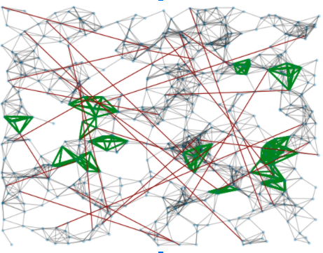

# Model overview:  simple_network_sim 
**Basics**
The model simple_network_sim is a network-based simulation model built for COVID-19 and written in Python. 

The core team includes:
* Jess Enright (modelling lead)
* Paul Johnson (epidemiologist)
* Bob Turner (research software engineer)

Development is supported by contributing volunteer engineers and developers. 

**Nodes-as-populations vs nodes-as-individuals**
There are currently two versions of the model suitable at different scales under development.  

In the ***nodes-as-populations*** version, each node contains an age-structured population and fractional people within that population are recorded as in various disease states.  We assume that the scale of the simulation is such that individuals do not progress between age classes.   As we will see in the next section, disease progression in this version is largely deterministic.  This version is currently considered the core version of this model, and is likely to be usable at larger population scales. 

In the ***nodes-as-individuals*** version, each node is a single infectious unit or individual, and can only have one disease state.  This version is far more stochastic, is currently considered an alternate version, and is likely to be more appropriate at finer scale. 

**Disease progression compartmental model**
We use a compartmental model including the states:
* S: susceptible
* E: exposed, but not yet infectious
* A: asymptomatic infectious individuals
* I: symptomatic infectious individuals
* H: hospitalised individuals 
* R: recovered (assumed immune)
* D: dead

Movement between **S** and **E** is mediated by the infectious process model, all other transitions are determined by an input transition matrix that encodes the rates along the arrows in the following diagram:

Different rates by age class are possible. 

In the *nodes-as-populations* case, movements between the compartments is deterministic, and floating-point numbers of people are recorded.

In the *nodes-as-individuals* case, a state is chosen for the node using probabilities derived from the transition rates, and a nodes has exactly one state at any time.  

**Infectious process model**
The infectious process moves people from the **S**usceptible to the **E**xposed states/compartments. 

In the *nodes-as-populations* model, there are two types of infection: within-node infection and between-node infection. Within-node infection uses an age-mixing matrix and the number of people within a node in an infecting state (currently only **A** and **I** - infection by hospitalised individuals in discussion) of each age to generate a number of new infections within age classes.  Between-node infection (currently only inflicted on adult people) is determined by the proportion of infecting individuals in a source node, the weight of the contact between nodes, and the proportion of susceptible individuals in the receiving node. 

In the *nodes-as-individuals* model, all infection is between-nodes, and all infectious nodes transmit infection over edges to their susceptible neighbours with probability determined by the weight of the edge. 

**Order of simulation**
Loading input files is now separated from the basic simulation.  After initial setup of the network, population, and epidemiological parameters, the basic simulation runs in the following order:

For each time step:
* simulate disease progression for those already exposed or infected
* simulate infection within a population at a node (if appropriate)
* simulate infection between nodes

**Inputs**
Our aim is to have as much of the specification of model parameters as possible in input files rather than within the core code of the mode. 

Current inputs:
* age-structured population information for each node
* weighted edges between nodes (we expect weights to be number of contacts per day). This file also has an adjustment factor for the movement multiplier
* movement multiplier - used to dampen or heighten the original weights between nodes over time
* epidemiological parameter file
* age-mixing matrix
* locations for nodes - currently only used when generating geographically-local edges in the nodes-as-individuals version

*We suggest consulting the README and the sample_input_files folder at the [GitHub repo](https://github.com/ScottishCovidResponse/simple_network_sim) for examples of input files and how to use them.*

**Edge generation**
There is some infrastructure for generating edges between nodes rather than reading them from file, including geographically local random edges, uniformly at random (Erdos-Renyi-style) edges, and strong local edges meant to simulate regular local contact e.g. sharing childcare.  We expect modelling other important networks to be an area of future development.

An example network structure with uniformly randomly distributed nodes (households or individuals), local transmission edges in grey, strong local edges in green, and uniformly randomly chosen long-distance edges in red.  

**Outputs and logging**
We have code infrastructure for producing simple log files that record the number of individuals in each state at each node at each time step of a simulation. 

**Key areas under current development**

In addition to important operational and I/O development (e.g. setting up a testing regime, integrating the age-mixing matrix properly, sourcing appropriate data, etc.) We also have modelling aspects under development, including:
* test-trace-isolate regimes
* hospital infection
* modelling care-homes explicitly
* simulating various contact networks
